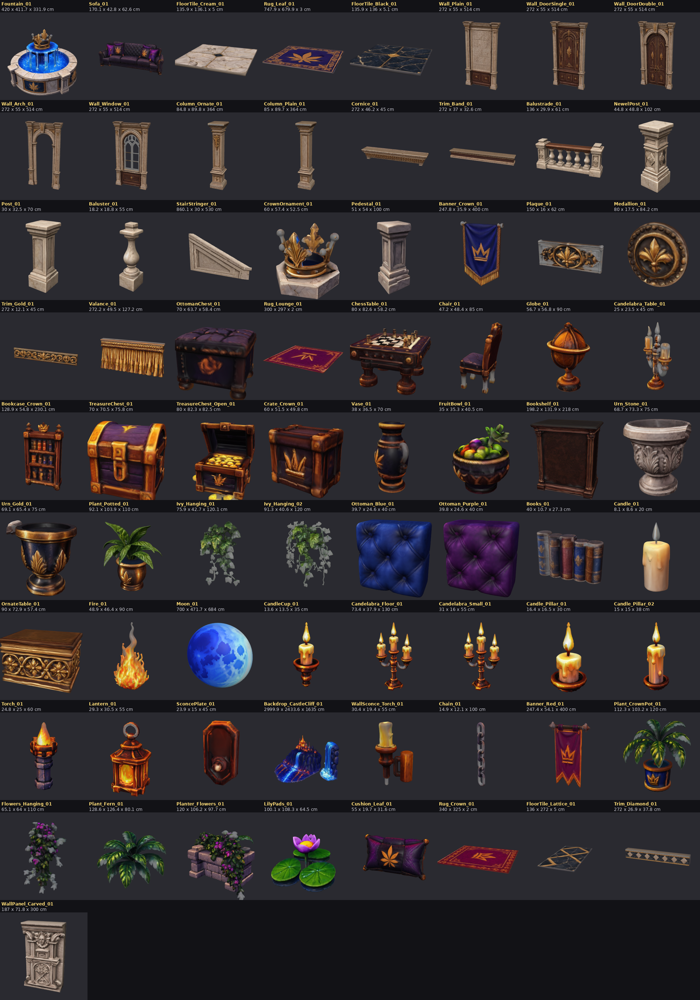
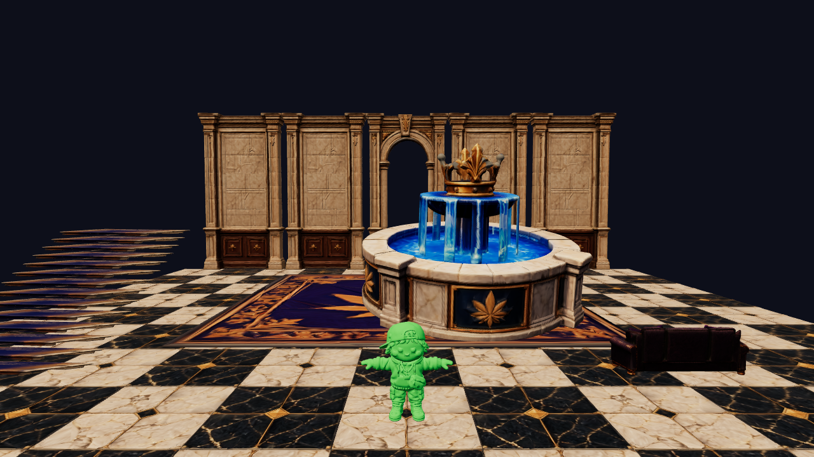

# Leafy Manor Model Kit (from your Tripo sheets)

Your 9 FBX "kit sheets" were split into separate pieces, scaled to game size for the 97.8 cm character, given pivots and
simple collision, and exported one FBX per model into `LeafyManor/Models/`. Everything is reproducible with
`Tools/KitProcessing/` (Blender 4.5 as a Python module).

## Conventions
* **Units**: metres in the FBX with *FBX Units Scale*, the same as your character. Unreal imports them at the listed centimetre sizes.
* **Facing**: the front faces Blender −Y, which is Unreal +Y. Walls have their pivot at the bottom centre of the **back** face; most props at the bottom centre; banners and ivy at the top back.
* **Collision**: `UCX_` boxes or a hull are inside each FBX. Unreal picks them up automatically (turn *Generate Missing Collision* off). Decorations have no collision.
* **Materials**: each FBX has one material slot, `M_LM_Kit_<Sheet>`. All pieces from the same sheet share one texture set (your original 8K atlas, reduced to 4K):
  * `Models/Textures/T_LM_Kit_<Sheet>_BaseColor.jpg` (sRGB)
  * `..._Normal.png`, already converted to **DirectX** green (Unreal convention; don't tick *Flip Green Channel*)
  * `..._ORM.jpg`: R = AO, G = Roughness, B = Metallic (sRGB off, compression *Masks*)
  * `T_LM_StairCarpet_BaseColor.png`, `T_LM_Marble_Cream_BaseColor.png`, `T_LM_Marble_Black_BaseColor.png`: flat captures for the stairs/floor materials
* **Nanite**: enable it on import for architecture, the fountain and statues. Polycounts are already reduced (1.5k–80k triangles per model), so it also works without Nanite.

## Still missing
Nothing from the original list. (The ornamental-statues upload added knights, lions, dogs, busts, clocks, fireplaces and the chandelier.)

## Models (88)

| Model | Folder | Used for | Size W × D × H (cm) | Triangles | Collision | Source (your file, piece) |
|---|---|---|---|---|---|---|
| `SM_LM_Wall_Plain_01` | Architecture | Wall bay (ground + upper story) | 272 × 55 × 514 | 40k | box | door+set.fbx P01 |
| `SM_LM_Wall_DoorSingle_01` | Architecture | Side doors (closed) | 272 × 55 × 514 | 40k | box | door+set.fbx P04 |
| `SM_LM_Wall_DoorDouble_01` | Architecture | Vestibule inner doors (closed) | 272 × 55 × 514 | 40k | box | door+set.fbx P05 |
| `SM_LM_Wall_Arch_01` | Architecture | Front entrance (open arch, 141 cm wide walk-through) | 272 × 55 × 514 | 40k | 3 boxes | door+set.fbx P06 |
| `SM_LM_Wall_Window_01` | Architecture | Upper-story window bays | 272 × 55 × 514 | 40k | box | door+set.fbx P07 |
| `SM_LM_Column_Ornate_01` | Architecture | Gallery / vestibule columns | 80 × 80 × 487 | 15k | box | door+set.fbx P02 |
| `SM_LM_Column_Plain_01` | Architecture | Gallery + corner columns | 80 × 80 × 487 | 12k | box | door+set.fbx P03 |
| `SM_LM_Cornice_01` | Architecture | Top of walls under the ceiling | 272 × 46.2 × 45 | 15k | none | door+set.fbx P09 |
| `SM_LM_Trim_Band_01` | Architecture | Gallery edge / base band | 272 × 37 × 32.6 | 6k | none | door+set.fbx P10 |
| `SM_LM_Balustrade_01` | Architecture | Gallery, entry and porch railings | 136 × 29.9 × 61 | 20k | box | Stairs.fbx P04 |
| `SM_LM_NewelPost_01` | Architecture | Stair bottom posts / entry pillars | 44.8 × 48.8 × 102 | 10k | box | Stairs.fbx P01 |
| `SM_LM_Post_01` | Architecture | Railing posts | 30 × 32.5 × 70 | 6k | box | Stairs.fbx P03 |
| `SM_LM_Baluster_01` | Architecture | Loose baluster | 18.2 × 18.8 × 55 | 4k | box | Stairs.fbx P02 |
| `SM_LM_StairStringer_01` | Architecture | Side panel of the grand stairs | 860.1 × 30 × 530 | 12k | none | Stairs.fbx P12 |
| `SM_LM_Fountain_01` | Props | Central fountain | 420 × 411.7 × 331.9 | 80k | hull | Architecture.fbx P12 |
| `SM_LM_CrownOrnament_01` | Props | Crown statues on pedestals / pillars | 60 × 57.4 × 52.5 | 15k | box | Architecture.fbx P14 |
| `SM_LM_Pedestal_01` | Props | Statue pedestals | 51 × 54 × 100 | 8k | box | Architecture.fbx P07 |
| `SM_LM_Banner_Crown_01` | Props | Wall banners | 247.8 × 35.9 × 400 | 12k | none | Architecture.fbx P10 |
| `SM_LM_Plaque_01` | Props | Over-door ornament | 150 × 16 × 62 | 10k | none | Architecture.fbx P09 |
| `SM_LM_Medallion_01` | Props | Wall ornament | 80 × 17.5 × 84.2 | 8k | none | Architecture.fbx P05 |
| `SM_LM_Trim_Gold_01` | Architecture | Gold wall trim | 272 × 12.1 × 45 | 8k | none | Architecture.fbx P08 |
| `SM_LM_Valance_01` | Props | Gold fringe over doors/windows | 272.2 × 49.5 × 127.2 | 12k | none | Architecture.fbx P11 |
| `SM_LM_Sofa_01` | Furniture | Lounge sofas | 170.1 × 42.8 × 62.6 | 30k | box | key+prop+sheet.fbx P08c |
| `SM_LM_OttomanChest_01` | Furniture | Lounge | 70 × 63.7 × 58.4 | 10k | box | key+prop+sheet.fbx P08a |
| `SM_LM_Rug_Lounge_01` | Furniture | Lounge rugs | 300 × 297 × 2 | 12k | none | key+prop+sheet.fbx P08b |
| `SM_LM_ChessTable_01` | Furniture | East lounge | 80 × 82.6 × 58.2 | 25k | box | key+prop+sheet.fbx P09b |
| `SM_LM_Chair_01` | Furniture | Chess chairs / armchairs | 47.2 × 48.4 × 85 | 12k | box | key+prop+sheet.fbx P09a |
| `SM_LM_Globe_01` | Furniture | The orb/globe (east) | 56.7 × 56.8 × 90 | 12k | box | key+prop+sheet.fbx P04a |
| `SM_LM_Candelabra_Table_01` | Props | Tables / mantels | 25 × 23.5 × 45 | 8k | none | key+prop+sheet.fbx P04b |
| `SM_LM_Bookcase_Crown_01` | Furniture | Under-gallery bookcases | 128.9 × 54.8 × 230.1 | 20k | box | key+prop+sheet.fbx P13 |
| `SM_LM_TreasureChest_01` | Furniture | Decoration | 70 × 70.5 × 75.8 | 10k | box | key+prop+sheet.fbx P15 |
| `SM_LM_TreasureChest_Open_01` | Furniture | Decoration | 80 × 82.3 × 82.5 | 15k | box | key+prop+sheet.fbx P12b |
| `SM_LM_Crate_Crown_01` | Furniture | Decoration | 60 × 51.5 × 49.8 | 6k | box | key+prop+sheet.fbx P06 |
| `SM_LM_Vase_01` | Props | Decoration | 38 × 36.5 × 70 | 8k | box | key+prop+sheet.fbx P02 |
| `SM_LM_FruitBowl_01` | Props | Decoration | 35 × 35.3 × 40.5 | 8k | none | key+prop+sheet.fbx P07 |
| `SM_LM_Bookshelf_01` | Furniture | Under-gallery bookshelves | 198 × 55 × 218 | 25k | box | Props+and+foliage.fbx P03b |
| `SM_LM_Urn_Stone_01` | Props | Planters around the fountain | 68.7 × 73.3 × 75 | 7k | box | Props+and+foliage.fbx P03a |
| `SM_LM_Urn_Gold_01` | Props | Planters around the fountain | 69.1 × 65.4 × 75 | 5k | box | Props+and+foliage.fbx P03a |
| `SM_LM_Plant_Potted_01` | Props | Hall plants | 92.1 × 103.9 × 110 | 25k | box | Props+and+foliage.fbx P02c |
| `SM_LM_Ivy_Hanging_01` | Props | Hanging from balcony rails | 75.9 × 42.7 × 120.1 | 20k | none | Props+and+foliage.fbx P02a |
| `SM_LM_Ivy_Hanging_02` | Props | Hanging from balcony rails | 91.3 × 40.6 × 120 | 20k | none | Props+and+foliage.fbx P02f |
| `SM_LM_Ottoman_Blue_01` | Furniture | Decoration | 39.7 × 24.6 × 40 | 6k | box | Props+and+foliage.fbx P02b |
| `SM_LM_Ottoman_Purple_01` | Furniture | Decoration | 39.8 × 24.6 × 40 | 6k | box | Props+and+foliage.fbx P04 |
| `SM_LM_Books_01` | Props | Decoration | 40 × 10.7 × 27.3 | 6k | none | Props+and+foliage.fbx P05 |
| `SM_LM_Candle_01` | Props | Decoration | 8.1 × 8.6 × 20 | 2k | none | Props+and+foliage.fbx P06 |
| `SM_LM_OrnateTable_01` | Furniture | Coffee table (west lounge) | 90 × 72.9 × 57.4 | 15k | box | Props+and+foliage.fbx P08 |
| `SM_LM_Fire_01` | Props | Fireplace fire | 48.9 × 46.4 × 90 | 8k | none | Props+and+foliage.fbx P09 |
| `SM_LM_Moon_01` | Props | Night sky | 700 × 471.7 × 684 | 8k | none | Lighting+and+mood.fbx P01 |
| `SM_LM_CandleCup_01` | Props | Sconce candles | 13.6 × 13.5 × 35 | 6k | none | Lighting+and+mood.fbx P02 |
| `SM_LM_Candelabra_Floor_01` | Props | Floor candelabras | 73.4 × 37.9 × 130 | 12k | box | Lighting+and+mood.fbx P03 |
| `SM_LM_Candelabra_Small_01` | Props | Mantels / tables | 31 × 16 × 55 | 8k | none | Lighting+and+mood.fbx P03 |
| `SM_LM_Candle_Pillar_01` | Props | Decoration | 16.4 × 16.5 × 30 | 4k | none | Lighting+and+mood.fbx P05 |
| `SM_LM_Candle_Pillar_02` | Props | Decoration | 15 × 15 × 38 | 4k | none | Lighting+and+mood.fbx P06 |
| `SM_LM_Torch_01` | Props | Porch / exterior | 24.8 × 25 × 60 | 8k | none | Lighting+and+mood.fbx P07 |
| `SM_LM_Lantern_01` | Props | Porch lanterns | 29.3 × 30.5 × 55 | 10k | none | Lighting+and+mood.fbx P08 |
| `SM_LM_SconcePlate_01` | Props | Wall sconce back plate | 23.9 × 15 × 45 | 4k | none | Lighting+and+mood.fbx P11 |
| `SM_LM_Backdrop_CastleCliff_01` | Props | Night view through the doors | 2999.9 × 2433.6 × 1635 | 40k | none | Lighting+and+mood.fbx P04 |
| `SM_LM_WallSconce_Torch_01` | Props | Wall sconces | 19.4 × 30.4 × 55 | 6k | none | Architectural+element.fbx P07 |
| `SM_LM_Chain_01` | Props | Chandelier chains | 14.9 × 12.1 × 100 | 3k | none | Architectural+element.fbx P08 |
| `SM_LM_Banner_Red_01` | Props | Wall banners | 247.4 × 54.1 × 400 | 12k | none | Architectural+element.fbx P01 |
| `SM_LM_Plant_CrownPot_01` | Props | Hall plants | 112.3 × 103.2 × 120 | 25k | box | Environment+details.fbx P01 |
| `SM_LM_Flowers_Hanging_01` | Props | Hanging from balcony rails | 65.1 × 64 × 110 | 20k | none | Environment+details.fbx P02 |
| `SM_LM_Plant_Fern_01` | Props | Fill for urns | 128.6 × 126.4 × 80.1 | 20k | none | Environment+details.fbx P03 |
| `SM_LM_Planter_Flowers_01` | Props | Porch / hall planters | 120 × 106.2 × 97.7 | 25k | box | Environment+details.fbx P04 |
| `SM_LM_LilyPads_01` | Props | Fountain water | 100.1 × 108.3 × 64.5 | 10k | none | Environment+details.fbx P05 |
| `SM_LM_Cushion_Leaf_01` | Props | Sofa cushions | 55 × 19.7 × 31.6 | 6k | none | Environment+details.fbx P06 |
| `SM_LM_Rug_Crown_01` | Props | Vestibule rug | 340 × 325 × 2 | 12k | none | Environment+details.fbx P11 |
| `SM_LM_FloorTile_Cream_01` | Architecture | Checker floor | 135.9 × 136.1 × 5 | 2k | none | Materials.fbx P03 |
| `SM_LM_FloorTile_Black_01` | Architecture | Checker floor | 135.9 × 136 × 5.1 | 2k | none | Materials.fbx P05 |
| `SM_LM_FloorTile_Lattice_01` | Architecture | Floor border | 136 × 272 × 5 | 2k | none | Materials.fbx P08 |
| `SM_LM_Rug_Leaf_01` | Props | Grand leaf rug | 747.9 × 679.9 × 3 | 12k | none | Materials.fbx P09 |
| `SM_LM_Trim_Diamond_01` | Architecture | Floor/wall border | 272 × 26.9 × 37.8 | 4k | none | Materials.fbx P01 |
| `SM_LM_WallPanel_Carved_01` | Architecture | Fireplace surround / wall feature | 187 × 71.8 × 300 | 20k | none | Materials.fbx P04 |
| `SM_LM_KnightArmor_01` | Props | Knights by the doors and on the galleries | 51 × 43.7 × 160 | 25k | box | ornamental statues (tripo_convert_1818e40b…) P01a |
| `SM_LM_Fireplace_01` | Props | Lounge fireplaces | 381 × 79.9 × 348 | 33k | box | ornamental statues (tripo_convert_1818e40b…) P02a |
| `SM_LM_Fireplace_Tall_01` | Props | Alternative fireplace | 220 × 90 × 443 | 30k | box | ornamental statues (tripo_convert_1818e40b…) P02b |
| `SM_LM_LionStatue_01` | Props | Crowned lions flanking the fountain | 85.6 × 87.5 × 170 | 40k | box | ornamental statues (tripo_convert_1818e40b…) P03b |
| `SM_LM_GrandfatherClock_01` | Furniture | Under the east gallery | 43.7 × 30.1 × 180 | 15k | box | ornamental statues (tripo_convert_1818e40b…) P04 |
| `SM_LM_Clock_Ornate_01` | Furniture | Under the east gallery | 52.4 × 19.6 × 170 | 15k | box | ornamental statues (tripo_convert_1818e40b…) P05d |
| `SM_LM_Bust_01` | Props | North gallery | 64.5 × 44.5 × 150 | 20k | box | ornamental statues (tripo_convert_1818e40b…) P05f |
| `SM_LM_Bust_02` | Props | North gallery | 43.2 × 53.1 × 150 | 20k | box | ornamental statues (tripo_convert_1818e40b…) P05g |
| `SM_LM_DogStatue_01` | Props | Flanking the vestibule opening | 56.4 × 59.9 × 150 | 9k | box | ornamental statues (tripo_convert_1818e40b…) P06a |
| `SM_LM_DogStatue_02` | Props | Flanking the vestibule opening | 50.1 × 57.7 × 150 | 9k | box | ornamental statues (tripo_convert_1818e40b…) P06a |
| `SM_LM_Chandelier_01` | Props | Hall + vestibule chandeliers | 249.9 × 194.5 × 249.8 | 40k | none | ornamental statues (tripo_convert_1818e40b…) P06c |
| `SM_LM_WallSconce_Bowl_01` | Props | Wall sconces | 27.6 × 26.5 × 60 | 10k | none | ornamental statues (tripo_convert_1818e40b…) P06d |
| `SM_LM_Stair_Grand_01` | Architecture | Both diagonal grand staircases (41 treads, 12.2 cm risers) | 836 × 238 × 514 | <1k | none (ramp + blockers in level) | built by `build_stairs.py` |
| `SM_LM_StairBalustrade_01` | Architecture | Stair railings (your balusters + marble handrail) | 846 × 19 × 575 | 62k | none | built from `SM_LM_Baluster_01` |
| `SM_LM_Runner_01` | Architecture | Blue/gold carpet runner tile (165 cm) | 165 × 143 × 0 | <1k | none | your carpet texture |

Per-sheet piece numbers are shown in `Docs/Models/Sheet_<name>.png`.
