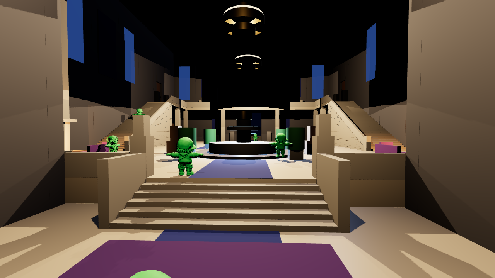
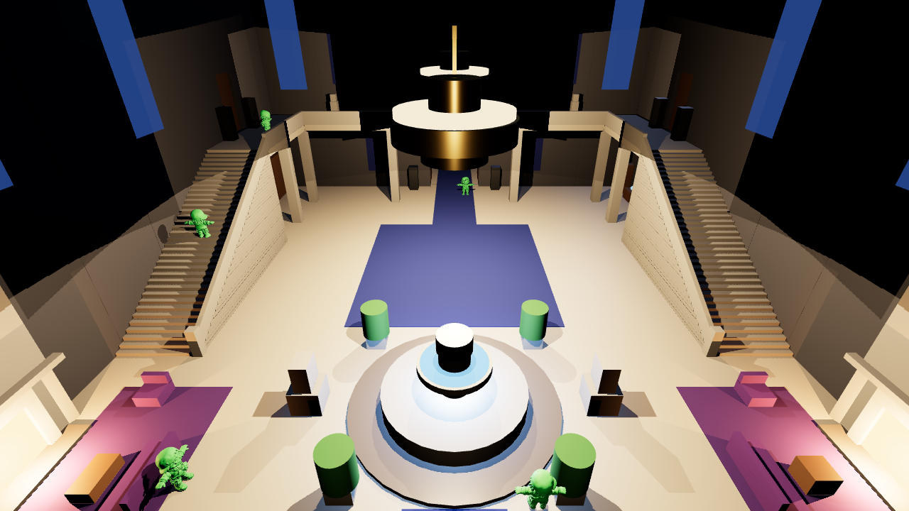

# Leafy Manor Entrance Hall: playable blockout

Script-generated blockout of the Leafy Manor entrance hall for Unreal Engine 5, built from the reference sheets in `Docs/Reference/` and scaled to your player character (97.8 cm tall, measured from your FBX). The same layout data drives the Unreal build script and an offline walkability validator, so what gets validated is exactly what gets built.

| Hero view from the vestibule (character FBX placed for scale) | Pixel-art composition check |
|---|---|
|  |  |

These previews come from a three.js render of the layout data, not from Unreal, and use flat blockout colours.

## Build it in Unreal (about 1 minute)

1. **Edit → Plugins**: enable **Python Editor Script Plugin** and **Editor Scripting Utilities**, then restart if asked.
2. Put the two files from `Unreal/Python/` next to each other anywhere on disk. `<YourProject>/Content/Python/` is the conventional place.
3. **Tools → Execute Python Script…** → `leafy_manor_build_blockout.py`.
4. The standard *Save changes?* dialog appears first; cancelling aborts without touching anything. The script then creates `/Game/LeafyManor/…` and opens `/Game/LeafyManor/Maps/LVL_LM_EntranceHall_Blockout`.
5. Press **Play**. Your project's default GameMode spawns **your existing character** at `PlayerStart_LM_Vestibule`, facing the hall.
   * If a different pawn spawns, set **World Settings → GameMode Override** to your GameMode. This changes only this level.

Re-running the script is safe: it deletes only actors tagged `LM_Blockout` and rebuilds them. Existing assets are reused. Set `REBUILD_MATERIALS = True` in the script to regenerate the blockout materials.

The script does **not** create or modify any character, controller, camera, GameMode or project setting, and it writes only inside `/Game/LeafyManor/`.

## Play-test checklist (with your character)

`TP_LM_Test_*` target points (Outliner → `LeafyManor_Blockout/Gameplay/TestPoints`) mark every spot below. Press **P** in the editor viewport to show the NavMesh; green = walkable.

- [ ] Spawn in the vestibule, walk up the 6 entry steps to the main floor
- [ ] Circle the fountain on its low plinth; you can't enter the water or jump onto it
- [ ] Walk between the lions, planters and lounge furniture without snagging; you can't step up onto sofas or tables
- [ ] Walk **up the west stairs**, along the west gallery → north gallery (over the doors) → east gallery, and **down the east stairs**
- [ ] Try to jump off the galleries or the sides of the stairs (invisible walls should stop you; the camera should not pop)
- [ ] Walk under the galleries (bookshelves, side doors, clock/desk)
- [ ] Go out the front doors onto the porch; invisible walls keep you there, and the night garden is visible
- [ ] Watch the camera under the galleries (364 cm headroom) and near walls

Tell me the result of anything that fails, plus your capsule radius / half-height / MaxStepHeight / camera arm length, and I'll adjust.

## Offline validation

```bash
python3 Tools/validate_blockout.py                               # your character's capsule (assumed r28 / hh50)
python3 Tools/validate_blockout.py --radius 42 --half-height 96   # UE template capsule
```

Recast-style walkability check on the exact spawned geometry. It covers capsule-radius clearance, headroom, MaxStepHeight step-ups, "can't step up on" props, ledges/falls, and reachability of all 29 test points from the PlayerStart. It also checks stair riser and slope against CharacterMovement limits, and door and walkway widths.

**Current result: PASS for both capsules (0 errors, 0 warnings).** It found 463 m² walkable and reachable, all 29 test points reachable, and no fall into the void or into a pocket you can't walk out of. Report: `Docs/Validation/validation_report.txt`.

Map (`Docs/Validation/walkability_map.png`, north up, left = ground level, right = upper level):
green = reachable ground, teal = vestibule, green→blue = stairs/galleries by height, orange = standable but unreachable (tops of props), grey = solid, red = ledge, white = test point.

## Changing scale or character metrics

Everything lives at the top of `Unreal/Python/leafy_manor_layout.py`:

```python
PLAYER = {"mesh_height_cm": 97.8, "capsule_radius_cm": 28.0, "capsule_half_height_cm": 50.0,
          "max_step_height_cm": 45.0, "walkable_floor_angle_deg": 44.765}
GRANDEUR = 1.25          # 1.0 = "real" proportions around the character, higher = grander
LM_SCALE = ...           # derived: height / 180 * GRANDEUR  (0.68)
```

After changing it, run the validator, then re-run the build script.

## Files

```
LeafyManor/
  Unreal/Python/leafy_manor_layout.py          layout data (no Unreal import) – single source of truth
  Unreal/Python/leafy_manor_build_blockout.py  run inside Unreal Editor
  Tools/validate_blockout.py                   offline walkability validator (pure Python 3)
  Docs/BlockoutSpec.md                         reference analysis, decisions, plan, dimensions, collision rules
  Docs/BlenderModelRequests.md                 every Blender model needed, in the requested spec format
  Docs/Validation/                             validator reports + walkability maps
  Docs/Preview/                                layout preview renders (character FBX for scale)
  Docs/Reference/                              the two reference images
```

## Status

| Step | State |
|---|---|
| 1 Analyse references | Done – `Docs/BlockoutSpec.md` |
| 2 Blockout | Done – 307 modular pieces (walls in 272 cm bays, floors, stairs, galleries, columns, doors, fountain, fireplaces, furniture proxies, rugs, banners, windows, chandeliers, exterior) |
| 3 Player scale | Done – fitted to the 97.8 cm character; capsule values are assumed until you confirm them |
| 4 Main architecture | Done (blockout level) |
| 5 Collision | Done – simple collision everywhere, stair ramps, invisible safety walls, no-step-up furniture |
| 6 Walk test | Offline validator passes. **Still needs your in-editor play test** (Unreal can't run in this environment) |
| 7–10 Final meshes, materials, props, decoration | Waiting on the Blender models in `Docs/BlenderModelRequests.md` |
| 11–14 Lighting, fountain FX, optimisation, final test | Not started (work lights only) |
