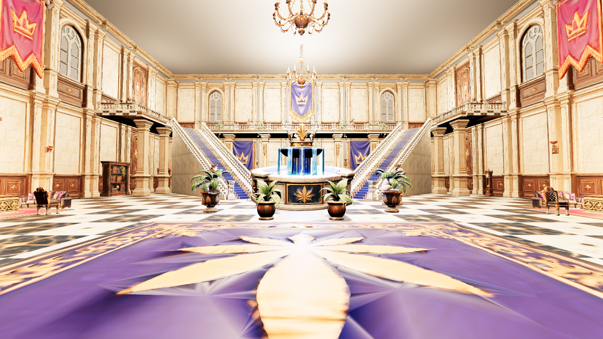
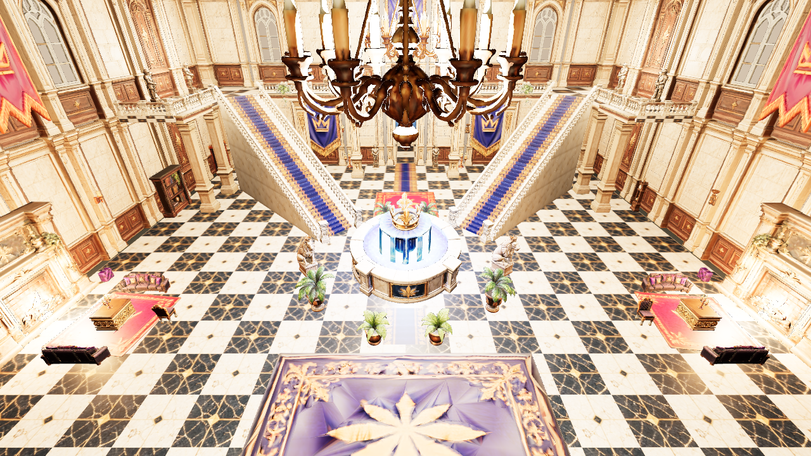
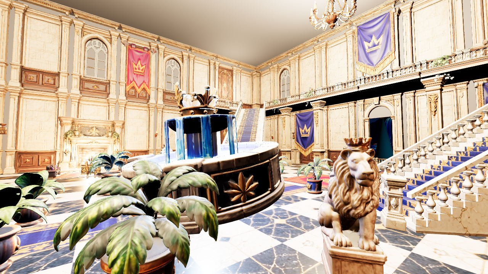
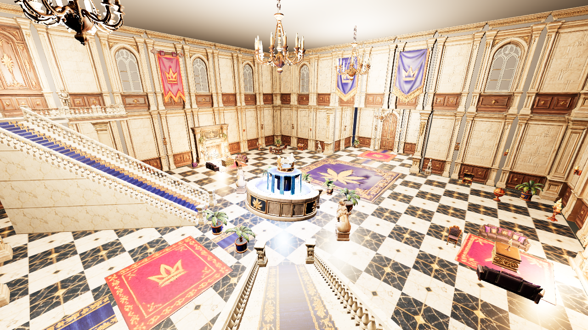

# Leafy Manor Entrance Hall

The Leafy Manor entrance hall for Unreal Engine 5, built by a script from:
- the reference sheets in `Docs/Reference/`
- your floor-plan diorama
- your model kit (88 game-ready models split from your Tripo sheets)

It's scaled to your player character (97.8 cm, measured from your FBX). The same layout data drives the Unreal build script and an offline walkability validator, so what's validated is exactly what gets built.

| Entry view (character placed for scale) | Overview |
|---|---|
|  |  |
|  |  |

These previews are browser (three.js) renders of the exact layout and models. They are not Unreal screenshots, and the lighting in Unreal will differ.

## Build it in Unreal

1. **Edit → Plugins**: enable **Python Editor Script Plugin** and **Editor Scripting Utilities**.
2. Clone or pull this repo; the script reads models from `LeafyManor/Models`. If you copy the Python files elsewhere, set `MODELS_DIR` at the top of `leafy_manor_build.py`.
3. **Tools → Execute Python Script…** → `LeafyManor/Unreal/Python/leafy_manor_build.py`.
   * The first run imports 88 models and 34 textures and builds the materials. This takes a few minutes, longer while Nanite builds.
   * The standard *Save changes?* dialog appears first; Cancel aborts without changing anything.
4. Open `/Game/LeafyManor/Maps/LVL_LM_EntranceHall` and press **Play**. Your project's default GameMode spawns your character in the vestibule, facing the hall.
   * If a different pawn spawns, set **World Settings → GameMode Override** to your GameMode. This affects only this level.

Re-running is safe: the script only replaces actors it created (tag `LM_Blockout`) and skips assets that already exist. Settings at the top of the script:

| Setting | Default | Effect |
|---|---|---|
| `DRESSED` | `True` | `False` builds the grey blockout only, with no import |
| `REIMPORT_MODELS` | `False` | `True` re-imports every model and texture |
| `REBUILD_MATERIALS` | `False` | `True` rebuilds the generated materials |
| `ENABLE_NANITE` | `True` | Turns Nanite on for the kit meshes |
| `SCONCE_LIGHTS` | `True` | Adds a small warm light at every wall sconce |

The script writes only inside `/Game/LeafyManor/`. It never touches your character, controller, camera, GameMode or project settings.

## Layout (follows your floor plan)

* **Size:** 24.5 m square hall with two-storey walls (514 cm each) built from your wall kit, cornice, arched windows and a marble checker floor.
* **Centre:** crowned fountain, ringed by planters with two crowned lions.
* **North–south axis:** blue/gold carpet runner, leaf rug and crown rug. The front arch opens to a porch with the night garden, castle backdrop and moon.
* **Stairs:** two 45° grand staircases (41 steps, 12.2 cm risers, your balusters) rise from beside the fountain to landings on the U-shaped balcony (NW and NE corners).
* **Lounges:** in the middle of the west and east walls, each with a fireplace, two sofas, table, chair and rug.
* **South-west corner:** globe, treasure chest and plants.
* **South-east corner:** chess table and chairs.
* **Entrance:** crowned dogs flank the vestibule opening, and the vestibule is where you spawn.
* **Dressing:** knights, busts, bookcases, clocks, banners, ivy, chandeliers and sconces.

Collision:
* **Walls and stairs:** hidden simple-collision stand-ins, plus a smooth invisible ramp on each stair.
* **Balconies and stair sides:** invisible walls up to the ceiling. They're ignored by the camera, so it doesn't pop.
* **Models:** each keeps its UCX box, and furniture can't be stepped onto.
* **Decoration:** rugs, banners and similar pieces have no collision.

## Checks

```bash
python3 LeafyManor/Tools/validate_blockout.py                               # your character's capsule (assumed r28 / hh50)
python3 LeafyManor/Tools/validate_blockout.py --radius 42 --half-height 96   # UE template capsule
```

**Current result: PASS for both capsules** (0 errors, 0 warnings).
* 605 m² is walkable and reachable from the PlayerStart.
* All 25 test points are reachable on foot: both stairs, every balcony, behind the stairs, the lounges, the porch.
* There are no drops into the void and no dead-end pockets.

Reports and maps are in `Docs/Validation/`. The Unreal script has also been run against a mocked `unreal` module to check its own logic; the real engine run is still to do.

## Play-test checklist

`TP_LM_Test_*` markers (Outliner → `LeafyManor/Gameplay/TestPoints`) mark every spot. Press **P** in the viewport to show the NavMesh.

- [ ] Walk from the vestibule round the fountain, between the lions and planters
- [ ] Walk up a diagonal staircase, round the whole balcony, and down the other staircase
- [ ] Try to jump off the balcony or the side of a stair (invisible walls should stop you)
- [ ] Walk through both lounges and the south corners without snagging on furniture
- [ ] Walk under the balconies, including behind the staircases
- [ ] Go out through the front arch onto the porch

## Files

```
LeafyManor/
  Unreal/Python/leafy_manor_build.py    run inside Unreal Editor
  Unreal/Python/leafy_manor_layout.py   the hall layout (single source of truth)
  Unreal/Python/leafy_manor_kit.py      model sizes / pivots / collision (generated)
  Models/{Architecture,Props,Furniture} 88 FBX models with UCX collision
  Models/Textures/                      4K BaseColor / Normal (DirectX) / ORM per kit sheet + floor/stair textures
  Tools/validate_blockout.py            offline walkability validator (pure Python 3)
  Tools/KitProcessing/                  Blender scripts that split/scale/export your sheets + build the stairs
  Docs/ModelKit.md                      every model: size, use, source piece
  Docs/BlockoutSpec.md                  reference analysis, layout decisions, collision rules
  Docs/BlenderModelRequests.md          the original model specs
  Docs/Preview, Docs/Validation, Docs/Models, Docs/Reference
```

## Status

| Step | State |
|---|---|
| 1–6 Analysis, blockout, scale, architecture, collision, walk test | Done; offline validator passes. Your in-editor play test is still needed |
| 7 Replace blockout with real models | Done: 88 models from your sheets + a procedural staircase |
| 8 Materials | Done: kit materials from your textures, marble checker floor, stair marble and carpet |
| 9–10 Furniture, props, plants, decoration | Done (first pass) |
| 11 Lighting | Work lights only: chandeliers, fireplaces, fountain, sconces, moon. The full mood pass is next |
| 12 Fountain water and FX | Not started (Niagara water, fire, candle flicker) |
| 13–14 Optimisation, final test | Nanite on; profiling needs your in-editor run |
