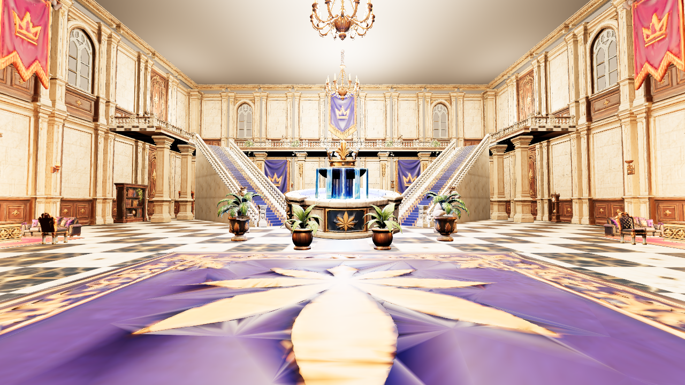
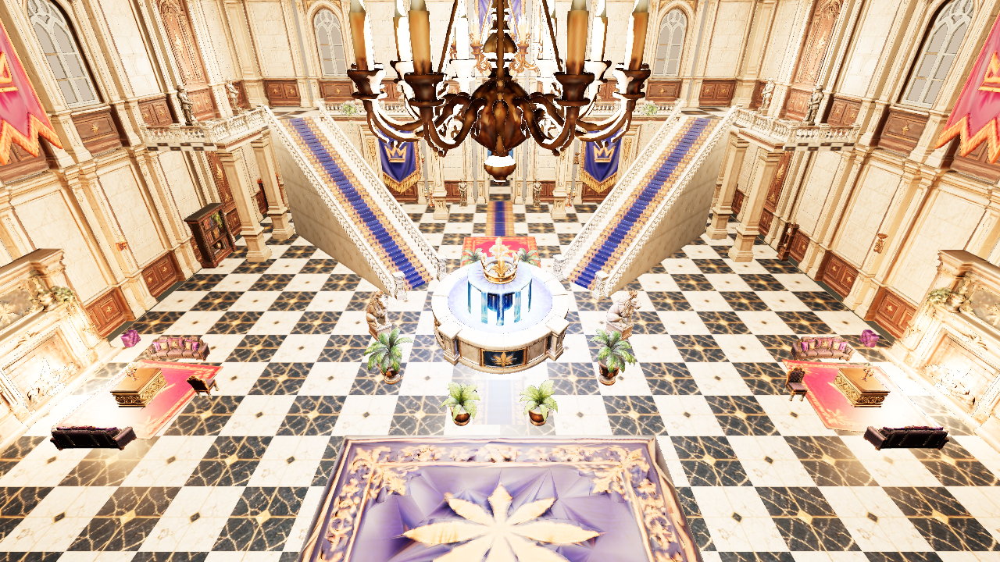
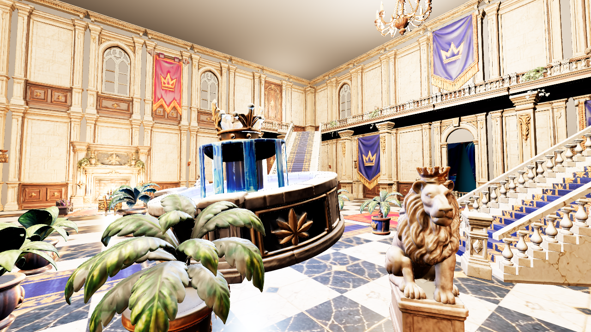
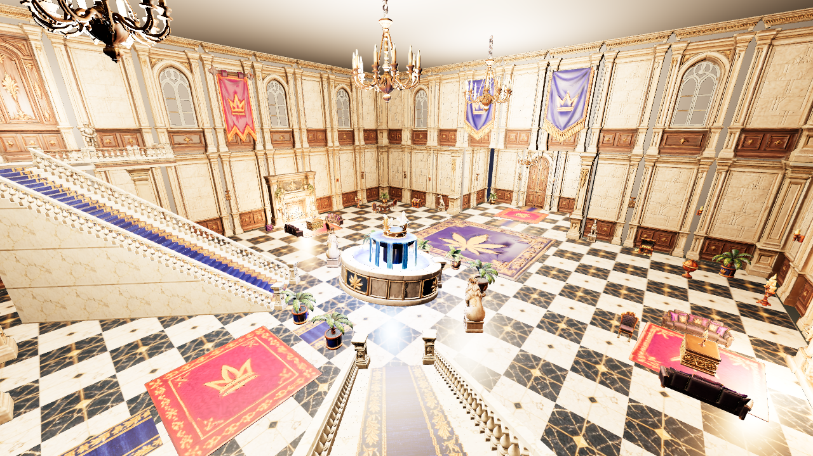

# Leafy Manor Entrance Hall

The Leafy Manor entrance hall for Unreal Engine 5, built by a script from:
- the reference sheets in `Docs/Reference/`
- your floor-plan diorama
- your model kit (107 game-ready models: split from your Tripo sheets, plus generated banners, rugs and fountain water)

It's scaled to your player character (97.8 cm, measured from your FBX). The same layout data drives the Unreal build script and an offline walkability validator, so what's validated is exactly what gets built.

| Entry view (character placed for scale) | Overview |
|---|---|
|  |  |
|  |  |

These previews are browser (three.js) renders of the exact layout and models. They are not Unreal screenshots, and the lighting in Unreal will differ.

## Play it in your browser

`Web/` is a browser version of the hall. You play as your character, using lighter copies of the models.
* **Run it locally:** it must be served, because opening `index.html` directly won't load the models. Run `cd LeafyManor/Web && python3 -m http.server 8000`, then open http://localhost:8000.
* **Controls:** WASD to move, mouse to look, Shift to run, Space to jump, the mouse wheel for camera distance and R to return to the entrance. Phones get an on-screen joystick.
* **Day / Night:** the hall opens at night, candlelit like the master sheet, with glowing flames and water and reflections in the floor. Press **N** or the Day/Night button to switch; your choice is remembered.
* **Collision:** it uses the same walkability data as `Tools/validate_blockout.py`.
* **Editing the hall:** press **Edit hall** (or Tab) to move props and furniture around.
  * Drag a model to move it. **Q** and **E** turn it; there are also Duplicate, Delete and Add buttons.
  * Things sitting on a model move with it, such as cushions on a sofa.
  * Walls and stairs stay fixed.
  * When you press **Play**, the game works out again where you can walk.
* **Saving your edits:** online they save automatically; in a local copy they save in your browser. To make them permanent, tell Claude "apply my hall edits", or click **Copy changes** and paste them to Claude. They are saved to `Unreal/Python/leafy_manor_edits.json`.
  * The Unreal build script, the checker and the browser game all read that file.
  * Delete the file to go back to the original layout.
* **Rebuilding:** after a layout or model change, rebuild it with `Tools/WebWalkthrough/build_web.sh`. The settings are listed at the top of that script.

## Quick start on Windows (double-click)

In the repo folder:
* **`Build Leafy Manor.bat`** opens your Unreal project and builds the level (it runs `leafy_manor_build.py` for you). Run it once, and again after you pull new changes. The level is left open, so you can press **Play** in the editor.
* **`Play Leafy Manor.bat`** opens the level straight into play, in its own window. Close the game with Alt+F4.

The first time, each launcher finds Unreal Engine 5 and your project. It looks in `Documents\Unreal Projects`; if it can't tell, it asks you to drag in `UnrealEditor.exe` or your `.uproject`. The answers are saved in `Unreal/local_paths.cfg`; delete that file to choose again. The project needs the **Python Editor Script Plugin** enabled, as in step 1 below.

## Build it in Unreal

1. **Edit → Plugins**: enable **Python Editor Script Plugin** and **Editor Scripting Utilities**.
2. Clone or pull this repo; the script reads models from `LeafyManor/Models`. If you copy the Python files elsewhere, set `MODELS_DIR` at the top of `leafy_manor_build.py`.
3. **Tools → Execute Python Script…** → `LeafyManor/Unreal/Python/leafy_manor_build.py`.
   * The first run imports the 107 models and their textures and builds the materials. This takes a few minutes, longer while Nanite builds.
   * The standard *Save changes?* dialog appears first; Cancel aborts without changing anything.
4. Open `/Game/LeafyManor/Maps/LVL_LM_EntranceHall` and press **Play**. Your project's default GameMode spawns your character in the vestibule, facing the hall.
   * If a different pawn spawns, set **World Settings → GameMode Override** to your GameMode. This affects only this level.

Re-running is safe: the script only replaces actors it created (tag `LM_Blockout`) and skips assets that already exist. Settings at the top of the script:

| Setting | Default | Effect |
|---|---|---|
| `DRESSED` | `True` | `False` builds the grey blockout only, with no import |
| `REIMPORT_MODELS` | `False` | `True` re-imports every model and texture |
| `REBUILD_MATERIALS` | `False` | `True` rebuilds the generated materials |
| `ENABLE_NANITE` | `True` | Turns Nanite on for the kit meshes |
| `SCONCE_LIGHTS` | `True` | Adds a small warm light at every wall sconce |
| `MOOD` | `True` | The night, candlelit look from the master sheet (below). `False` gives the plain, evenly lit hall |

### Mood (the master-sheet look)

With `MOOD = True` the build adds:

* **Post-process:**
  * Darker auto-exposure, stronger bloom and a vignette.
  * Navy shadows and warm highlights.
  * Lumen global illumination and reflections, so the polished floor mirrors the candles.
* **Volumetric fog** (`Fog_LM_Haze`): the candles, chandeliers and fountain glow through a light haze.
* **Lights:**
  * Candle lights on every floor candelabra, table candelabra and lantern.
  * Brighter fireplaces that flicker (light function `Lighting/M_LM_LF_Flicker`).
  * A stronger blue fountain light, brighter sconces, and a dimmer sky and moon.
* **Materials:**
  * `M_LM_KitFX` makes flames, candle tips, the fire and the fountain water glow (with a gentle flicker). It also turns the purple, pink and red rugs and banners navy while keeping their gold.
  * Per-model instances are in `Materials/Kit/FX`, set from `FX_MATERIALS`.
  * The floor uses `M_LM_FloorMarble`, which is darker and almost mirror-polished.
  * The cream walls and stairs are tinted darker.

To tune the look, change the `MOOD_*` values at the top of the script and re-run. The glow and recolour amounts in `FX_MATERIALS` only apply when an instance is first created: to apply changed values, delete `Materials/Kit/FX` before re-running, or edit the instances directly in the editor. The fireplace flicker material is also only created once: to rebuild it, delete `Lighting/M_LM_LF_Flicker`.

If the hall looks too dark or too bright, change `MOOD_EXPOSURE_EV` and `MOOD_EXPOSURE_BIAS`. The EV values assume the project setting **Extend default luminance range in Auto Exposure settings** is on, which is the UE5 default.

The script writes only inside `/Game/LeafyManor/`. It never touches your character, controller, camera, GameMode or project settings.

## Layout (follows your floor plan)

* **Size:** 24.5 m square hall with two-storey walls (514 cm each) built from your wall kit, cornice, arched windows and a marble checker floor.
* **Centre:** crowned fountain with glowing water, ringed by planters and fern urns, with two crowned lions on marble pedestals.
* **Walkway:** tall palms and lit lantern posts frame the walk to the fountain, and more palms stand at the foot of each staircase.
* **North–south axis:** blue/gold carpet runner, navy and gold leaf rug and crown rug. The front arch opens to a porch with the night garden, castle backdrop and moon.
* **Stairs:** two 45° grand staircases (41 steps, 12.2 cm risers, your balusters) rise from beside the fountain to landings on the U-shaped balcony (NW and NE corners). Tall candelabras flank the foot of each.
* **Lounges:** in the middle of the west and east walls, each with a fireplace under a castle painting, two purple velvet sofas, a wingback armchair, a round table with candles and a rug.
* **South-west corner:** globe, treasure chest and plants.
* **South-east corner:** chess table and chairs.
* **Entrance:** crowned dogs flank the vestibule opening, and the vestibule is where you spawn.
* **Dressing:** knights, busts, bookcases, clocks, sconces and 30-candle chandeliers. Ivy garlands swag along the gallery rails, ferns hang under the galleries, and crown vases stand by the entrance. The upper side walls carry the banners "GOOD PLANTS BETTER PEOPLE" (west) and "HIGHER TOGETHER" (east). Potted plants flank each hearth.

Collision:
* **Walls and stairs:** hidden simple-collision stand-ins, plus a smooth invisible ramp on each stair.
* **Balconies and stair sides:** invisible walls up to the ceiling. They're ignored by the camera, so it doesn't pop.
* **Models:** each keeps its UCX box, and furniture can't be stepped onto.
* **Decoration:** rugs, banners and similar pieces have no collision.

## Checks

```bash
python3 LeafyManor/Tools/validate_blockout.py                               # your character's capsule (assumed r28 / hh50)
python3 LeafyManor/Tools/validate_blockout.py --radius 42 --half-height 96   # UE template capsule
```

**Current result: PASS for both capsules** (0 errors, 0 warnings).
* 605 m² is walkable and reachable from the PlayerStart.
* All 25 test points are reachable on foot: both stairs, every balcony, behind the stairs, the lounges, the porch.
* There are no drops into the void and no dead-end pockets.

Reports and maps are in `Docs/Validation/`. The Unreal script has also been run against a mocked `unreal` module to check its own logic; the real engine run is still to do.

## Play-test checklist

`TP_LM_Test_*` markers (Outliner → `LeafyManor/Gameplay/TestPoints`) mark every spot. Press **P** in the viewport to show the NavMesh.

- [ ] Walk from the vestibule round the fountain, between the lions and planters
- [ ] Walk up a diagonal staircase, round the whole balcony, and down the other staircase
- [ ] Try to jump off the balcony or the side of a stair (invisible walls should stop you)
- [ ] Walk through both lounges and the south corners without snagging on furniture
- [ ] Walk under the balconies, including behind the staircases
- [ ] Go out through the front arch onto the porch

## Files

```
LeafyManor/
  Unreal/Python/leafy_manor_build.py    run inside Unreal Editor
  Unreal/Python/leafy_manor_layout.py   the hall layout (single source of truth)
  Unreal/Python/leafy_manor_kit.py      model sizes / pivots / collision (generated)
  Models/{Architecture,Props,Furniture} 107 FBX models with UCX collision
  Models/Textures/                      4K BaseColor / Normal (DirectX) / ORM per kit sheet + floor/stair textures
  Tools/validate_blockout.py            offline walkability validator (pure Python 3)
  Tools/KitProcessing/                  Blender scripts that split/scale/export your sheets + build the stairs
  Tools/WebWalkthrough/                 scripts that build the browser version in Web/
  Web/                                  browser walkthrough (three.js): index.html + models + walk grid
  Docs/ModelKit.md                      every model: size, use, source piece
  Docs/BlockoutSpec.md                  reference analysis, layout decisions, collision rules
  Docs/BlenderModelRequests.md          the original model specs
  Docs/Preview, Docs/Validation, Docs/Models, Docs/Reference
```

## Status

| Step | State |
|---|---|
| 1–6 Analysis, blockout, scale, architecture, collision, walk test | Done; offline validator passes. Your in-editor play test is still needed |
| 7 Replace blockout with real models | Done: 107 models from your sheets, plus a procedural staircase, banners, rugs and fountain water |
| 8 Materials | Done: kit materials from your textures, marble checker floor, stair marble and carpet |
| 9–10 Furniture, props, plants, decoration | Done (first pass) |
| 11 Lighting | Work lights only: chandeliers, fireplaces, fountain, sconces, moon. The full mood pass is next |
| 12 Fountain water and FX | Not started (Niagara water, fire, candle flicker) |
| 13–14 Optimisation, final test | Nanite on; profiling needs your in-editor run |
